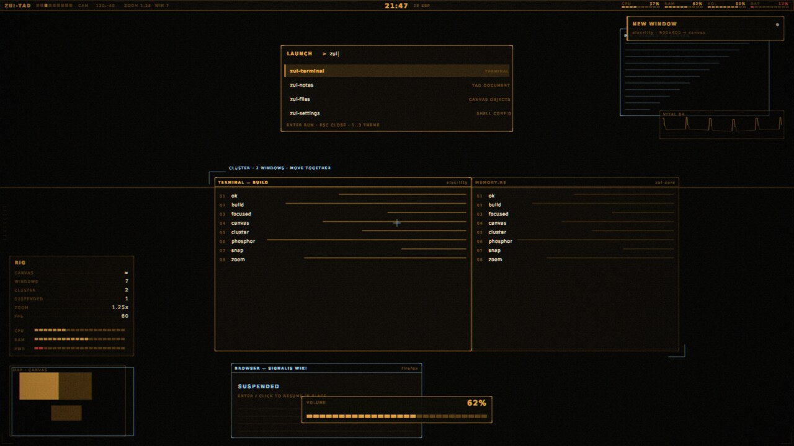
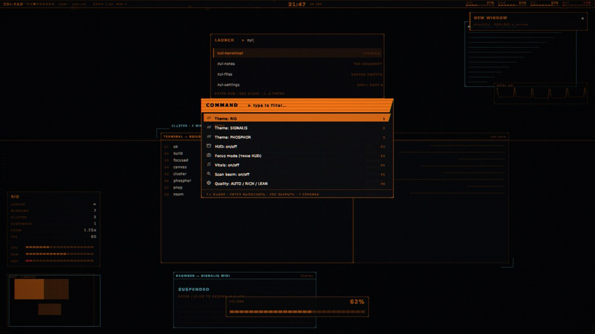
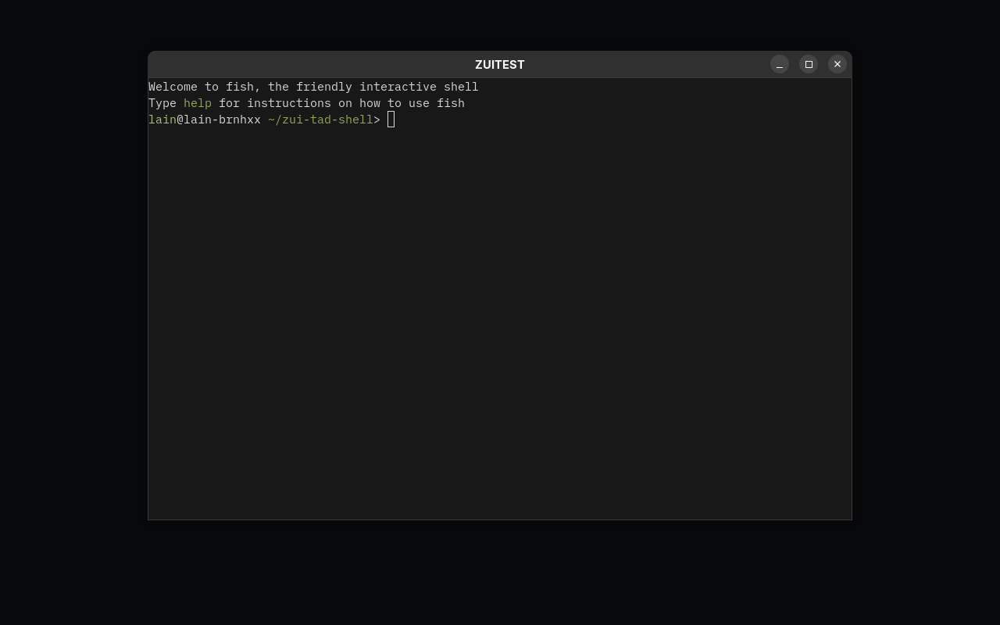
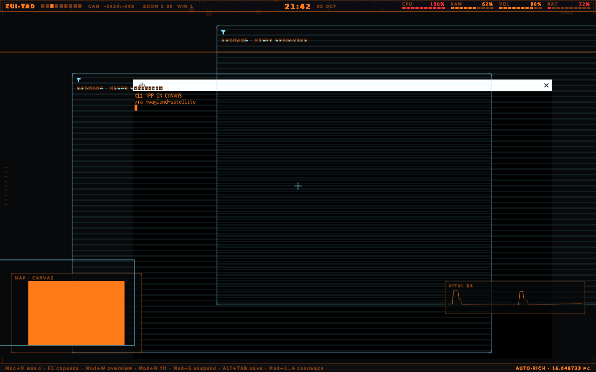
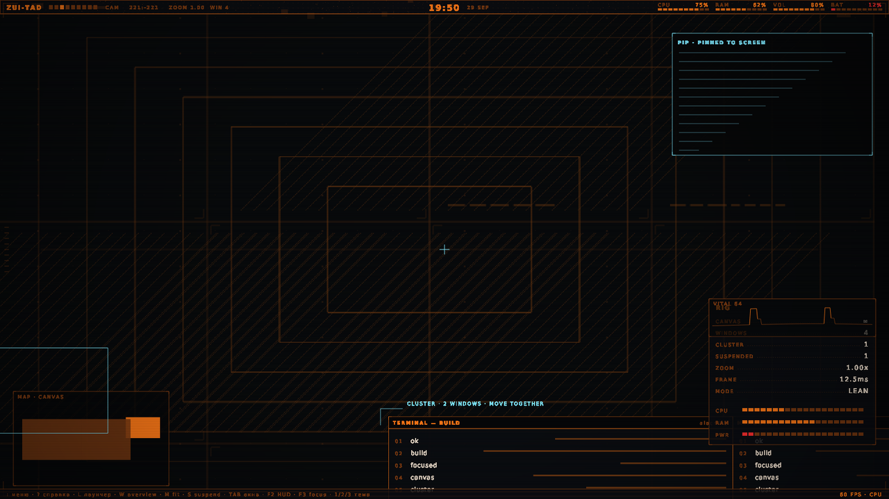
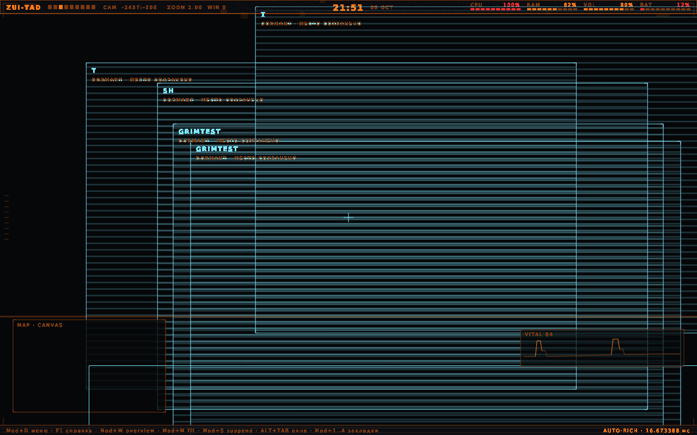

# ZUI-TAD Shell — an infinite-canvas Wayland desktop

[](https://github.com/kostyk348/zui-tad-shell/actions/workflows/ci.yml)


-lightgrey)

**ZUI-TAD** is a desktop that throws away workspaces and tiling. Windows keep
their **native size on an infinite 2D canvas**, and your screen is a **camera**
looking at it. There is no workspace list — there are canvas bookmarks, anchors
and implicit **clusters** of windows that snapped to each other.

On top of that sits a **phosphor-CRT shell** (Dead Space RIG × Signalis mood):
amber/orange monochrome, scanlines, dithering, segmented meters, a command
palette, an ECG vitals strip, a canvas minimap — and it is **pure CPU rendering**,
so it holds 60 fps with no GPU at all.

```text
┌─ ZUI-TAD ──▌▌▌▌▌▌▌▌▌─ CAM 120:-40  ZOOM 1.25  WIN 7 ── 21:47  29 SEP ── CPU ▌▌▌ RAM ▌▌▌▌ ─┐
│                                                                                          │
│        ╭──────────────╮   ╭──────────────╮        ╭─ CLUSTER · 2 WINDOWS ─╮               │
│        │ terminal     │   │ memory.rs    │        │  move together        │   ┌─ VITAL 64 ─┐
│        │ 01 ok        │   │ 01 ok        │        ╰───────────────────────╯   │  ╱╲___╱╲__ │
│        ╰──────────────╯   ╰──────────────╯                                    └───────────┘
│   ┌─ DORMANT · место сохранено ─┐                        ┌─ MAP · CANVAS ─┐
│   │ browser (suspended)         │                        │  ▉▉  ▉▉        │
│   └─────────────────────────────┘                        └────────────────┘
└─ : menu · ? help · L launcher · W overview · M fit · TAB windows · F2 HUD · F3 focus ──────┘
```

## Screenshots

| | |
|---|---|
|  |  |
| **Signalis theme** — amber CRT, scanlines, grain | **Command palette** — filter, groups, hints |
|  |  |
| **Real apps on the canvas** (kitty, fish) | **X11 apps on the canvas** (xterm via XWayland) |
|  |  |
| **Live preview**, 60 fps CPU, wallpaper + HUD | **Screenshot taken from inside** (`grim`) |

## Features

**Canvas, not workspaces**
* infinite 2D canvas; windows keep their native size, the viewport pans and zooms
* **snapping → implicit clusters**: touch two edges and they move/resize together
* directional jump to the nearest window (`←↑→↓`), MRU cycling (`Alt+Tab`),
  zoom-to-fit overview (`W`), canvas bookmarks (`Mod+1..4`), anchors
* **window suspend**: closing leaves a dormant placeholder; relaunching the same
  app *adopts its old spot*
* **session restore**: canvas, clusters, camera, bookmarks and anchors are saved
  (`session.json`) and restored dormant — nothing is auto-launched

**Real clients, really managed**
* drag by mouse, **resize from any of 8 edges** (sent to the client as `xdg configure`)
* maximize / fullscreen / minimize, including `move_request` / `resize_request`
  from client-side decorations
* click-to-focus, system resize cursors, client cursor surfaces and
  `cursor-shape-v1` named cursors
* **X11 apps work** through `xwayland-satellite` (xterm, Steam, browsers…)

**Shell**
* phosphor-CRT post-processing: ordered dither → scanlines → chromatic
  aberration → vignette → grain (deterministic by seed)
* top panel (canvas/zoom/window telemetry), canvas minimap, ECG vitals,
  viewfinder frame + reticle, toasts, hover HUD
* **command palette** (`:`) with fuzzy filter, groups, icons and mouse support
* help/FAQ overlay (`?`), focus mode (`F3`) for long sessions, hint bar
* 24 procedurally drawn icons and 5 procedural textures — no bitmap assets
* three themes: **Rig** (orange signal), **Signalis** (amber CRT), **Phosphor** (green)
* TOML config that survives restarts (`~/.config/zui-tad/shell.toml`)

**Protocols**
`wl_compositor`, `xdg_shell`, `wl_shm`, `wl_seat` (keyboard/pointer), `wl_output`
(+`xdg-output`), `xdg-decoration` (client-side), `primary-selection`,
`xdg-activation`, `wlr-layer-shell`, `session-lock`, `foreign-toplevel-list`,
`data-device`, `wp_viewporter`, `wp_single_pixel_buffer_v1`, `wp_content_type_v1`,
`wlr-screencopy` (screenshots: `grim` works inside the session).

## Try it

### 1. Shell preview (no GPU, no session needed)

```bash
git clone https://github.com/kostyk348/zui-tad-shell && cd zui-tad-shell
cargo run --release -p phosphor --bin zui-preview
```
A live window with a mock canvas: 4 windows, wallpapers, HUD, minimap, ECG,
command palette. Keys: `:` menu · `?` help · `1/2/3` themes · `F2` HUD ·
`F3` focus · `F6` quality · `L` launcher · `Space/W/M/S` · `+/-/0` zoom ·
mouse: drag windows, resize from the 9 px edge, pan on empty canvas,
`Mod`+wheel to zoom, click the panel to open the menu.

### 2. Real applications on the canvas (nested, inside any session)

```bash
export XDG_RUNTIME_DIR=${XDG_RUNTIME_DIR:-/run/user/$(id -u)}
ZUI_STORE_PATH=$PWD/data/store.sled ./target/release/zui-compositor &

WAYLAND_DISPLAY=zui-tad-0 kitty &          # Wayland client
xwayland-satellite :0 &                    # X11 support (build from source, see below)
DISPLAY=:0 xterm &                         # X11 client
WAYLAND_DISPLAY=zui-tad-0 grim shot.png    # screenshots work
```

### 3. Install as a session

```bash
./install.sh            # binaries + display-manager session entries (needs sudo)
./install.sh --user     # same into ~/.local
zui-compositor --check  # readiness report: DRM cards, connectors, input, X11, config
```
Then pick **ZUI-TAD** on your login screen (or run from a TTY).
The session wrapper auto-starts `xwayland-satellite` and your
`~/.config/zui-tad/autostart.sh`.

## Performance (measured)

Pure-CPU rendering at 1600×900 on a Ryzen 7 7840HS:

| | frame time | raw fps | RSS |
|---|---|---|---|
| first working version | 41 ms | 24 | 33 MB |
| after CRT/atlas work | 15.2 ms | 66 | 33 MB |
| **now** (memcpy blits, byte CRT, cached chrome, budgeted caches) | **7.2–7.8 ms** | **125–130** | **33 MB** |

Frame breakdown from the log:
`frame 7.7ms = compose 2.7 [bg 0.9 grid 0.2 cards 0.8 chrome 0.0 hud 1.0] + crt 3.9 + blit 0.5`.
Adaptive quality: `AUTO` drops to `LEAN` only if the average frame exceeds 90 %
of the 60 fps budget — in practice it stays `RICH`.

The compositor (nested, GL) reports 93–103 MB RSS, but **Pss ≈ 50–53 MB**; about
54 MB of that is *shared* Mesa/LLVM pages counted once for every GL process on the
system. Our own private memory is ~30 MB.

## Configuration

`~/.config/zui-tad/shell.toml` (created automatically; unknown keys are ignored):

```toml
theme = "rig"           # rig | signalis | phosphor
quality = "auto"        # auto | rich | lean
bg = "hull"             # hull | starfield | crt | blueprint | off | /path/to/image.png
hud = true              # minimap, vitals, hover HUD, viewfinder
vitals = true
beam = true             # CRT scan beam
focus_mode = false      # quiet mode: panel + hints only
help_on_start = false
```

Wallpapers are generated by our own code (no third-party game assets):

```bash
cargo run --release -p phosphor --bin gen_bg              # 1920x1080, 12 files
cargo run --release -p phosphor --bin gen_bg -- 2560 1440
ZUI_WALLPAPER=~/Pictures/wp.png cargo run --release -p phosphor --bin zui-preview
```

## Hotkeys (compositor)

| Key | Action |
|---|---|
| `Mod+D` / `F12` | command palette |
| `F1` / `?` | help overlay |
| `Mod+←↑→↓` | jump to nearest window |
| `Alt+Tab` | cycle windows (MRU) |
| `Mod+W` | overview (fit everything) |
| `Mod+M` | fit focused window |
| `Mod+S` | suspend focused window |
| `Mod+1..4` / `Mod+Shift+1..4` | jump to / set canvas bookmark |
| `Mod+±/0` | zoom in/out/reset |
| `Mod+Return` | terminal · `Mod+Q` close · `Esc` cancel grab |
| mouse | click panel → menu · drag window · 9 px edge → resize · double-click → fit |

## Architecture

```
shell      phosphor      panel · palette · help · HUD · OSD · wallpapers (CPU)
──────────────────────────────────────────────────────────────────────────────
compositor wl_output · xdg_shell · input · canvas render · screencopy · X11
──────────────────────────────────────────────────────────────────────────────
canvas     canvas-engine  Scene: windows, clusters, camera, interaction
──────────────────────────────────────────────────────────────────────────────
objects    tad-core       RO/VO model, sled storage, dormant placeholders
```

* `canvas-engine` knows nothing about Wayland or GPUs — pure logic, fast tests.
* `phosphor` knows nothing about the compositor — it draws into a CPU pixmap, so
  the same code feeds the preview (softbuffer), the compositor (GL texture) and
  `wlr-screencopy`.
* the compositor only holds the bridge: `xdg_toplevel ↔ WindowId`, input in world
  coordinates, `xdg configure` on resize.

Details and invariants: [`docs/ARCHITECTURE.md`](docs/ARCHITECTURE.md).
What is done, what is not, and why: [`docs/ROADMAP.md`](docs/ROADMAP.md).
DRM/TTY reconnaissance with verified signatures: [`docs/DRM-DESIGN.md`](docs/DRM-DESIGN.md).

## Status

| Area | State |
|---|---|
| canvas (camera, clusters, snapping, bookmarks, suspend) | ✅ |
| real Wayland clients, drag, 8-edge resize, maximize/minimize | ✅ verified live |
| **X11 apps** (via `xwayland-satellite`) | ✅ verified live (`xterm`) |
| shell in the compositor (panel, palette, help, HUD, toasts) | ✅ verified live |
| session restore (dormant + slot adoption) | ✅ verified live |
| **screenshots** (`wlr-screencopy`, `grim` inside) | ✅ verified live |
| DRM/TTY backend | ⚠ layer 0 only (`--drm`: session + card + connector plan); rendering/page-flip pending |
| `ext-idle-notify`, multi-monitor | ❌ needs the calloop transition / DRM |

## License

MIT. See [LICENSE](LICENSE). Asset provenance: [assets/CREDITS.md](assets/CREDITS.md) —
wallpapers are generated by our code; no third-party game assets are included.
